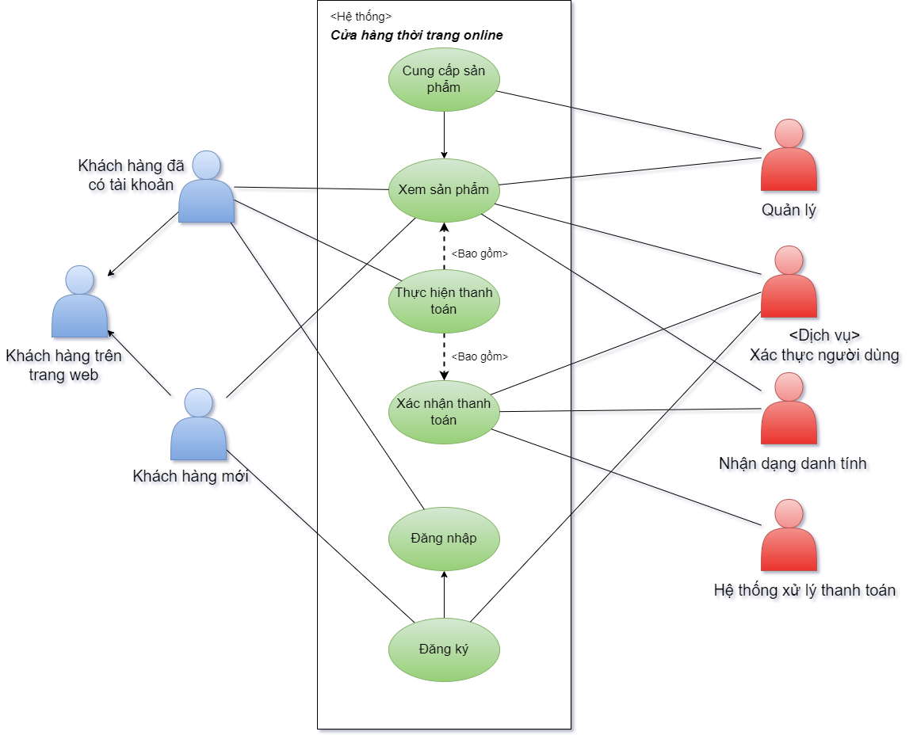
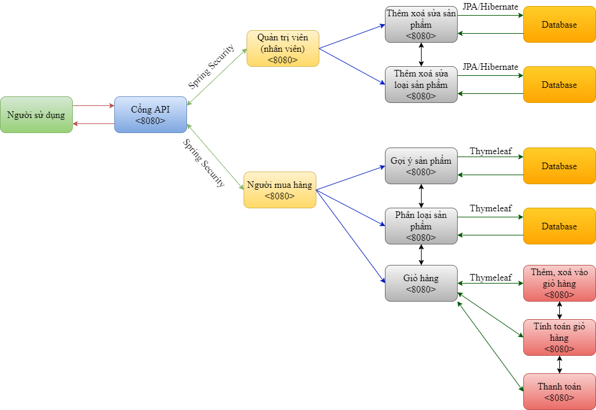

# Clothing E-commerce Website

## Introduction

This project is an e-commerce website for selling clothing built using Spring Boot, Spring Security, Thymeleaf, and utilizing MySQL to manage data. Lombok is used to reduce boilerplate code and increase source code simplicity.

### Objective

The objective of the project is to create a user-friendly, flexible, and easily scalable website for selling clothing.

### Key Technologies

- Spring Boot
- Spring Security
- Thymeleaf
- Lombok
- MySQL

## Use Case

### Use Case Description:
#### Actors:

- Customer: The end-user of the website, able to view products, add them to the cart, and proceed to checkout.
- Administrator: The website administrator, having the authority to manage products, orders, and users.
#### Use Cases:

- View Products: Both customers and administrators can view the list of products.
- Add to Cart: Customers can add products to the shopping cart.
- Checkout: Customers can proceed to checkout for their order.
- Manage Products: Administrators can add, edit, and delete products.
- Manage Orders: Administrators can view, confirm, and cancel orders.
- Manage Users: Administrators can manage user information.

#### Use Cases Diagram:

## System Architecture

### System Architecture Description:
- Frontend (Thymeleaf Templates): The user interface component, displaying product information and checkout interface.
- Controller Layer: Handles requests from users and routes them to the corresponding processing methods.
- Service Layer: Contains business logic and communicates with Repositories to access and manipulate data.
- Repository Layer: Performs data access and manipulation from the database.
- Database (MySQL): Stores product data, order information, and user data.

### System Architecture Diagram:

